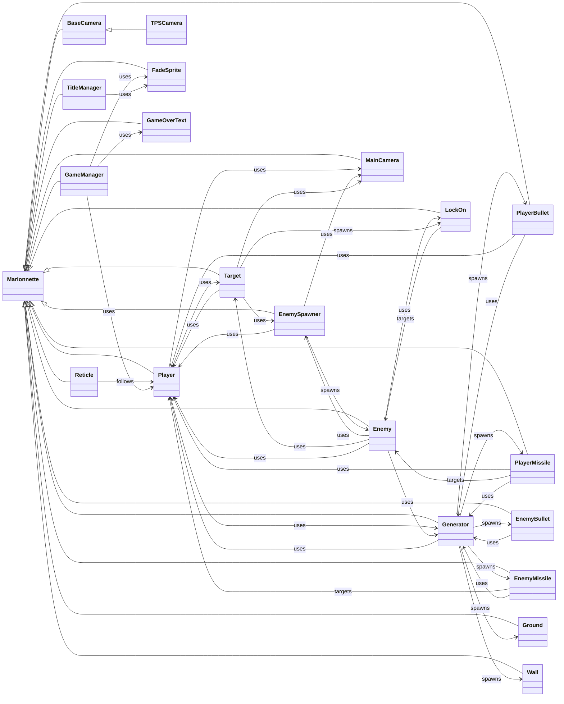

# UMLクラス図（主要クラス）

```mermaid
classDiagram
    direction LR

    class Marionnette

    class Player
    class Enemy
    class EnemySpawner
    class Generator
    class MainCamera
    class BaseCamera
    class TPSCamera
    class Target
    class LockOn
    class Reticle
    class PlayerBullet
    class PlayerMissile
    class EnemyBullet
    class EnemyMissile
    class Ground
    class Wall
    class GameManager
    class FadeSprite
    class GameOverText
    class TitleManager

    %% Inheritance
    Marionnette <|-- Player
    Marionnette <|-- Enemy
    Marionnette <|-- EnemySpawner
    Marionnette <|-- Generator
    Marionnette <|-- MainCamera
    Marionnette <|-- BaseCamera
    BaseCamera <|-- TPSCamera
    Marionnette <|-- Target
    Marionnette <|-- LockOn
    Marionnette <|-- Reticle
    Marionnette <|-- PlayerBullet
    Marionnette <|-- PlayerMissile
    Marionnette <|-- EnemyBullet
    Marionnette <|-- EnemyMissile
    Marionnette <|-- Ground
    Marionnette <|-- Wall
    Marionnette <|-- GameManager
    Marionnette <|-- FadeSprite
    Marionnette <|-- GameOverText
    Marionnette <|-- TitleManager

    %% Associations (major references)
    Player --> Target : uses
    Player --> MainCamera : uses
    Player --> Generator : uses

    Enemy --> EnemySpawner : uses
    Enemy --> Target : uses
    Enemy --> LockOn : uses
    Enemy --> Player : uses
    Enemy --> Generator : uses

    EnemySpawner --> Player : uses
    EnemySpawner --> Enemy : spawns
    EnemySpawner --> MainCamera : uses

    Generator --> Player : uses
    Generator --> PlayerBullet : spawns
    Generator --> PlayerMissile : spawns
    Generator --> EnemyBullet : spawns
    Generator --> EnemyMissile : spawns
    Generator --> Ground : spawns
    Generator --> Wall : spawns

    Target --> Player : uses
    Target --> MainCamera : uses
    Target --> EnemySpawner : uses
    Target --> LockOn : spawns

    LockOn --> Enemy : targets
    Reticle --> Player : follows

    PlayerBullet --> Player : uses
    PlayerBullet --> Generator : uses

    PlayerMissile --> Player : uses
    PlayerMissile --> Enemy : targets
    PlayerMissile --> Generator : uses

    EnemyBullet --> Generator : uses
    EnemyMissile --> Player : targets
    EnemyMissile --> Generator : uses

    GameManager --> FadeSprite : uses
    GameManager --> Player : uses
    GameManager --> GameOverText : uses

    TitleManager --> FadeSprite : uses
```
